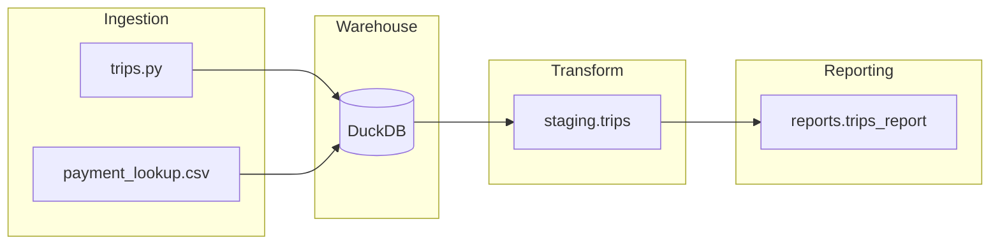

# 🚕 NYC Taxi ELT Platform with Bruin + DuckDB

Production-style modular ELT pipeline built using **Bruin**, **DuckDB**, **Python**, and **SQL** to ingest, transform, validate, and aggregate NYC Taxi trip data.

This project demonstrates how to design a clean, layered, incremental data platform with built-in quality enforcement and reproducible execution.

---

# 📌 Executive Summary

This project simulates a real-world analytics data platform with:

- Raw ingestion layer
- Clean staging layer
- Aggregated reporting layer
- Incremental time-based rebuilds
- Built-in data quality checks
- Fully reproducible local warehouse

It reflects modern data engineering practices used in production environments.

---

# 🏗 Architecture



---

# 🔎 Layered Architecture

## 1️⃣ Ingestion Layer

Assets:
- `ingestion.trips` (Python)
- `ingestion.payment_lookup` (Seed CSV)

Responsibilities:
- Load raw taxi trip data
- Append new records
- Keep ingestion logic minimal

Materialization strategy:
- `append`

Why?
- Raw data remains immutable
- Enables downstream reprocessing
- Preserves auditability

---

## 2️⃣ Staging Layer

Asset:
- `staging.trips`

Responsibilities:
- Normalize schema
- Clean invalid rows
- Join lookup tables
- Enforce business rules
- Apply data quality checks

Materialization:
- `time_interval`

Why?
- Rebuild only selected date range
- Efficient incremental processing
- Enables safe backfills

---

## 3️⃣ Reporting Layer

Asset:
- `reports.trips_report`

Responsibilities:
- Aggregate trips by date and taxi type
- Compute total trips
- Compute total revenue
- Provide dashboard-ready metrics

Materialization:
- `time_interval`

---

# ⚙️ Tech Stack

| Component | Tool |
|-----------|------|
| Orchestration | Bruin |
| Warehouse | DuckDB |
| Transformations | SQL |
| Ingestion | Python + Pandas |
| Loader Engine | dlt |
| Version Control | Git |

---

# 🔁 Incremental Processing Strategy

### Ingestion → `append`
New records are appended to raw tables.

### Staging & Reporting → `time_interval`

For each run window:

1. Delete rows within the time range
2. Recompute only that window
3. Insert fresh results

This simulates partition-based rebuild logic commonly used in production warehouses.

---

# 📊 Example Query Output

## Raw Report Table

```sql
SELECT *
FROM reports.trips_report
ORDER BY trip_date
LIMIT 5;
```

---

## Daily Revenue Aggregation

```sql
SELECT
    trip_date,
    SUM(total_revenue) AS daily_revenue
FROM reports.trips_report
GROUP BY trip_date
ORDER BY trip_date;
```

---

# ✅ Data Quality Enforcement

Implemented checks:

- `not_null`
- `unique`
- `non_negative`
- Custom invariant checks

Example configuration:

```yaml
checks:
  - name: not_null
  - name: non_negative
```

Successful pipeline execution:

```
✓ Assets executed      4 succeeded
✓ Quality checks       9 succeeded
```

---

# 🚀 How To Run

## 1️⃣ Install Bruin

```bash
curl -LsSf https://getbruin.com/install/cli | sh
```

---

## 2️⃣ Configure Warehouse

Create `.bruin.yml`:

```yaml
default_environment: default

environments:
  default:
    connections:
      duckdb-default:
        type: duckdb
        path: duckdb.db
```

---

## 3️⃣ Execute Pipeline

```bash
bruin run my-pipeline/pipeline/pipeline.yml \
  --start-date 2022-01-01 \
  --end-date 2022-02-01 \
  --var 'taxi_types=["yellow"]'
```

---

# 📈 Business Insight Example

This pipeline enables analysis such as:

- Daily revenue trends
- Taxi type performance comparison
- Volume anomalies detection
- Revenue spikes investigation
- Data quality violation detection

These are common real-world use cases in:

- Operations analytics
- Financial reporting
- Demand forecasting
- Performance monitoring

---

# 🧠 Engineering Decisions

## Why DuckDB?
- Embedded analytical engine
- Zero infrastructure setup
- Columnar performance
- Ideal for local analytics prototyping

## Why Bruin?
- Declarative pipelines
- Native time-window incremental logic
- Built-in data quality checks
- Clear asset lineage

## Why Layered Modeling?
- Separation of concerns
- Modular transformations
- Reusability
- Production scalability

---

# 🏭 Production Scaling Strategy

If deployed in production:

- Replace DuckDB → BigQuery / Snowflake
- Store raw data in object storage (S3 / GCS)
- Partition tables by date
- Add CI validation
- Enable automated backfills
- Add monitoring & alerting
- Introduce merge-based idempotency

---

# 🎯 Skills Demonstrated

- Incremental ELT design
- Warehouse modeling
- Data quality engineering
- Modular layered architecture
- Dependency management
- Backfill handling
- Reproducible analytics setup
- Production-oriented thinking

---

# 👨‍💻 Author

Rahmatulloh  
Data Engineering Enthusiast  
Focused on building modern, modular, scalable data platforms.

---

# ⭐ If You Like This Project

Feel free to star the repository or connect with me to discuss data engineering topics.
